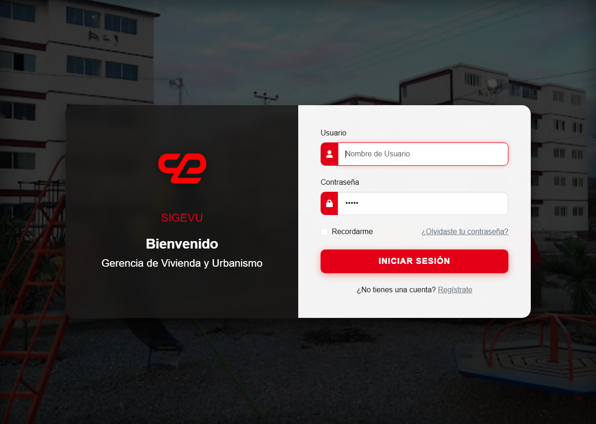
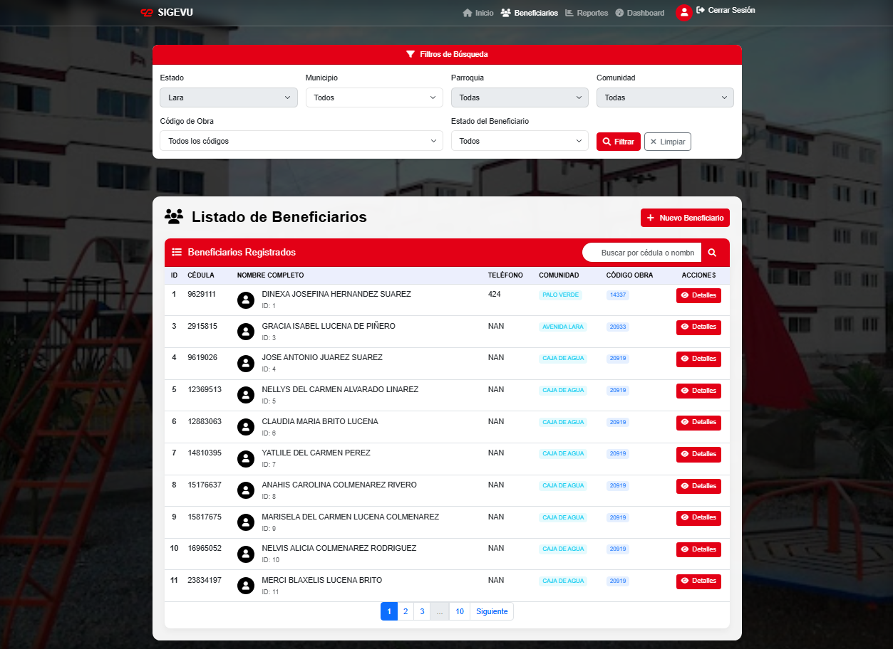
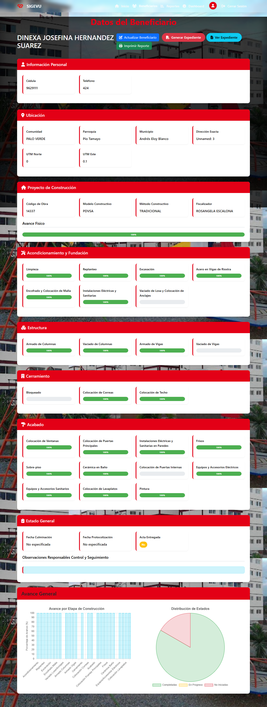
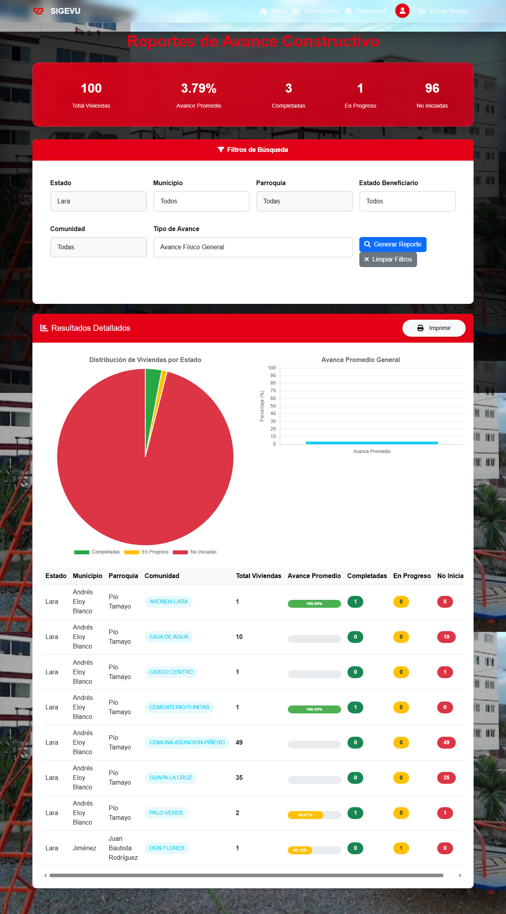

<div align="center">


<br/>


<br/>

> **Sistema web desarrollado durante pasantías profesionales en CORPOLARA para optimizar la gestión, consulta y administración de beneficiarios, viviendas y proyectos habitacionales.**

<br/>

[✨ Características](#-características) &nbsp;•&nbsp; [🛠️ Tecnologías](#️-tecnologías-utilizadas) &nbsp;•&nbsp; [📸 Capturas](#-capturas-de-pantalla) &nbsp;•&nbsp; [⚙️ Instalación](#️-instalación) &nbsp;•&nbsp; [👨‍💻 Autor](#-autor)

</div>

---

## 📖 Descripción

**SIGEVU** *(Sistema Integral para la Gestión de Viviendas)* es una plataforma web diseñada para **centralizar y digitalizar** la administración de programas habitacionales, brindando acceso rápido a la información de beneficiarios, viviendas y proyectos.

Desarrollado durante mis pasantías profesionales en **CORPOLARA**, el proyecto aplicó buenas prácticas de ingeniería de software, diseño relacional de bases de datos y principios de arquitectura MVC, resultando en una herramienta funcional utilizada en entorno institucional real.

```
🏢 Empresa:      CORPOLARA
📅 Período:      Pasantías Profesionales
🎯 Objetivo:     Digitalizar la gestión de programas habitacionales
🧩 Arquitectura: MVC (Modelo - Vista - Controlador)
```

---

## ✨ Características

<table>
  <tr>
    <td>

**👥 Beneficiarios**
- Registro y actualización de datos personales
- Consulta avanzada con filtros múltiples
- Historial completo por beneficiario

**🏘️ Viviendas**
- Registro detallado de unidades habitacionales
- Vinculación con beneficiario y proyecto
- Control de estado y disponibilidad

**📁 Proyectos**
- Administración de proyectos habitacionales
- Seguimiento de avance y asignaciones
- Estadísticas por proyecto

    </td>
    <td>

**🗺️ Ubicaciones**
- Gestión de ubicaciones geográficas
- Organización por estado, municipio y parroquia

**📊 Reportes**
- Generación de reportes detallados
- Exportación de datos para toma de decisiones

**⚡ Herramientas**
- 📥 Importación masiva de datos
- 🔐 Sistema de autenticación seguro
- 🖥️ Panel administrativo completo
- 📱 Diseño totalmente responsive

    </td>
  </tr>
</table>

---

## 🛠️ Tecnologías Utilizadas

<div align="center">

### Frontend


### Backend


### Base de Datos


### Herramientas


</div>

---

## 📸 Capturas de Pantalla

<details>
<summary><b>🔐 Login — Pantalla de acceso al sistema</b></summary>
<br/>



</details>

<details>
<summary><b>👥 Gestión de Beneficiarios — Listado y administración</b></summary>
<br/>



</details>

<details>
<summary><b>📋 Datos del Beneficiario — Ficha completa</b></summary>
<br/>



</details>

<details>
<summary><b>📊 Reportes — Generación y visualización</b></summary>
<br/>



</details>

---

## 📸 Capturas de Pantalla
### Login

### Gestión de Beneficiarios

### Datos del Beneficiario

### Reportes


## 🗄️ Estructura del Proyecto

```
📦 SIGEVU/
├── 🎨 assets/              # Recursos estáticos (CSS, JS, imágenes)
├── ⚙️  config/              # Configuración de base de datos y app
├── 🎮 controllers/         # Controladores MVC
├── 🗃️  models/              # Modelos y lógica de negocio
├── 👁️  views/               # Vistas y plantillas HTML
├── 🗄️  database/            # Scripts SQL y migraciones
└── 🚀 index.php            # Punto de entrada principal
```

---

## ⚙️ Instalación

Sigue estos pasos para ejecutar el proyecto localmente:

**1.** 📥 **Clonar el repositorio**
```bash
git clone https://github.com/Agabo32/Sistema_Central_de_Vivienda.git
cd Sistema_Central_de_Vivienda
```

**2.** 🗄️ **Crear la base de datos MySQL**
```sql
CREATE DATABASE sigevu CHARACTER SET utf8mb4 COLLATE utf8mb4_unicode_ci;
```

**3.** 📂 **Importar el archivo SQL**
```bash
mysql -u root -p sigevu < database/sigevu.sql
```

**4.** 🔧 **Configurar credenciales** en `config/database.php`
```php
define('DB_HOST', 'localhost');
define('DB_NAME', 'sigevu');
define('DB_USER', 'tu_usuario');
define('DB_PASS', 'tu_contraseña');
```

**5.** 🚀 **Iniciar con XAMPP o Apache** y abrir en el navegador:
```
http://localhost/SIGEVU
```

---

## 👨‍💻 Autor

<div align="center">


### Gabriel Torrealba

**Estudiante de Ingeniería en Sistemas**
*Especializado en desarrollo web y bases de datos*

[](https://github.com/Agabo32)

</div>

---

## 📄 Licencia

```
Proyecto desarrollado con fines académicos y profesionales.
Todos los derechos reservados © Gabriel Torrealba
```

---

<div align="center">

⭐ **Si este proyecto te fue útil, considera dejar una estrella en el repositorio** ⭐


</div>
